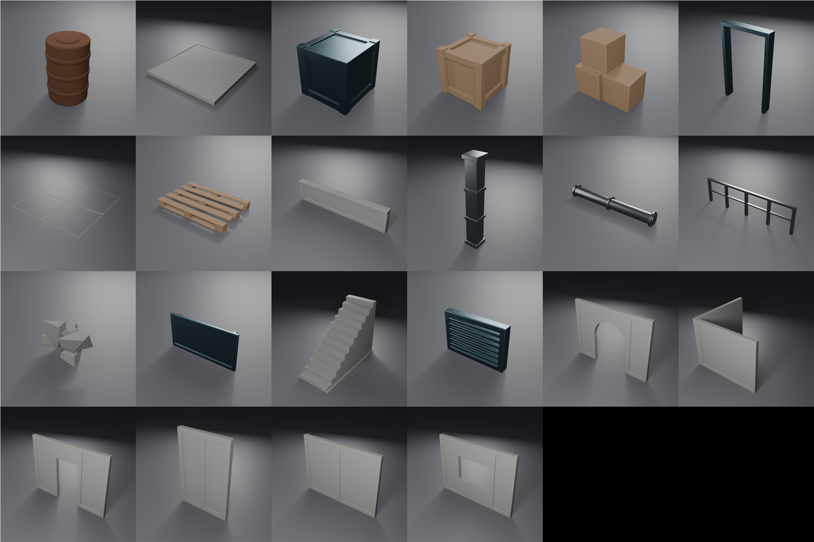

# ModKit — Modular Building Kit & Prop Pack

[](LICENSE)


A free, public-domain modular building kit and environment prop set for
Unreal Engine, Unity, three.js and Blender.



**Everything here is CC0.** Use it commercially, modify it, ship it, sell what
you make with it. No attribution required, no strings.

---

## What's inside

**Modular building kit (13 pieces)** — walls (straight, half, doorway, window,
arch, corner), floor and ceiling slabs, pillar, stairs, railing, doorframe,
parapet.

**Environment props (9 pieces)** — small and large crates, a pre-stacked crate
cluster, barrel, pallet, pipe run, wall vent, wall sign, rubble pile.

22 meshes, ~20,700 triangles for the entire set. No textures required — the
shading comes from geometry, not maps (see
[How the shading works](#how-the-shading-works)).

Everything is generated by script. There are no hand-placed vertices, so the
whole pack can be re-rolled at different proportions by changing a few
constants and running one command.


---

## Which files do I want?

| Folder | Format | Use it for |
|---|---|---|
| `exports/FBX_Nanite/` | FBX, one mesh each | **Unreal 5** (Nanite), **Unity** |
| `exports/FBX_LOD/` | FBX + LOD1–3 | Mobile, older engines, anything without Nanite |
| `exports/GLTF/` | GLB | **three.js**, Godot, web viewers |
| `source/ModKit.blend` | Blender 5.1 | Editing the originals |

All meshes are authored in metres — 1 unit = 1 m = 100 Unreal units.

---

## Quick start

### Unreal Engine 5

Drag `exports/FBX_Nanite/*.fbx` into the content browser:

| Setting | Value |
|---|---|
| Import Uniform Scale | 1.0 |
| Combine Meshes | on |
| Generate Lightmap UVs | on |
| Auto Generate Collision | on |
| Normal Import Method | Import Normals and Tangents |

Then select all → right-click → **Nanite → Enable**.

> **Import normals, don't recompute them.** The hard edges come from baked
> weighted normals. Letting Unreal recalculate will soften every bevel and the
> pack will look muddy.

Prefer to script it? See [`scripts/`](scripts/) — `ue_import.py`, `ue_lods.py`
and `ue_validate.py` handle import, LOD chains, materials and an audit pass.


### Unity

Drop `exports/FBX_Nanite/*.fbx` into `Assets/`. In the import inspector:

| Setting | Value |
|---|---|
| Convert Units | on |
| Scale Factor | 1 |
| Normals | Import |
| Generate Lightmap UVs | on (only if you bake lighting) |

Same caveat as Unreal: set **Normals → Import**, not Calculate.

Use `exports/FBX_LOD/` instead if you want the pre-built LOD meshes; Unity
imports them as separate meshes that you can wire into an `LODGroup`.

### three.js

Load the GLBs with `GLTFLoader` — they are exported Y-up, so no rotation fix
is needed:

```js
import { GLTFLoader } from 'three/addons/loaders/GLTFLoader.js';

const loader = new GLTFLoader();
loader.load('exports/GLTF/SM_Wall_Straight_4m.glb', (gltf) => {
  scene.add(gltf.scene);
});
```

Models are 4 m wide and 3 m tall in world units. The bundled materials are flat
PBR placeholders — swap in `MeshStandardMaterial` with your own maps.

### Blender

Open `source/ModKit.blend`. Every asset is laid out on a showcase grid, ready
to append into your own file.


---

## The grid

| Quantity | Metres | Unreal units |
|---|---|---|
| Module | 4 m | 400 uu |
| Wall height | 3 m | 300 uu |
| Wall thickness | 0.20 m | 20 uu |
| Floor slab | 0.20 m | 20 uu |
| Door opening | 1.20 × 2.20 m | 120 × 220 uu |
| Window opening | 1.80 × 1.20 m, sill at 1.00 m | 180 × 120 uu |

Set grid snap to **100 uu** for general work and **50 uu** for trim. Pieces line
up on 400/200/100 steps with no gaps.

### Pivots

* **Kit pieces** — origin at the **grid corner** (min X, min Y, min Z). Drop a
  wall on a grid intersection and it fills the module to its +X/+Y.
* **Floor slabs** — origin at the corner of the **top surface**, so a floor at
  `Z = 0` gives a walking surface at `Z = 0` and walls placed at `Z = 0` sit
  directly on it.
* **Props** — origin at **base centre**, so they drop onto floors without
  sinking and rotate about themselves.

---

## How the shading works

There are no normal-map bakes in this pack, and it doesn't need any. Each mesh
is built as a single watertight manifold via exact booleans, then gets:

1. a **Bevel** modifier — 1.2 cm, 2 segments, 30° angle limit, harden normals
2. a **Weighted Normal** modifier — keep sharp, weight 60
3. full smooth shading

That combination produces crisp hard edges with a highlight that rolls off
believably. It's why the pieces read as solid objects under moving light while
carrying no textures at all.

The booleans matter. Abutting loose boxes would leave interior faces and break
the bevel into disconnected fragments; unioning them into one solid keeps the
highlight edges unbroken and the triangle count honest.


---

## Re-rolling the pack

Everything is driven by constants at the top of `scripts/modkit_lib.py`:

```python
M       = 4.0    # module size
WALL_H  = 3.0    # wall height
WALL_T  = 0.20   # wall thickness
BEVEL_W = 0.012  # bevel width -- the single biggest lever on how it reads
```

Change them and rebuild (Blender 5.x on your PATH):

```bash
blender -b --factory-startup --python scripts/build_kit.py
blender -b source/ModKit.blend   --python scripts/render_previews.py
blender -b --factory-startup --python scripts/make_sheet.py
```

`build_kit.py` writes all three export formats, saves the .blend and refreshes
`docs/asset_manifest.csv`.

To add a piece, write a function returning `L.finish(bm, name, ...)` and add it
to `define_assets()`. The library gives you `add_box`, `add_cylinder`, `carve`,
`weld`, `carve_cylinder`, `jitter` and `recess_faces` to build with.

---

## Known quirks

* **Unreal ignores Blender's `LOD_` grouping null.** Importing `FBX_LOD/`
  directly yields four separate meshes rather than one LOD chain.
  `scripts/ue_lods.py` works around this by assigning Unreal's built-in LOD
  groups, which generates the chain in-engine — and Unreal's reducer gives
  cleaner silhouettes than Blender's decimate anyway.
* **`StaticMeshEditorSubsystem` is `None` inside a commandlet**, and the
  deprecated `EditorStaticMeshLibrary.set_lods` returns `-1` there. Both dead
  ends are documented in the script headers so you don't rediscover them.
* **The UV-channel column in `docs/ue_validation.txt` reads `0`.** That's a
  commandlet artifact — render data isn't built in that context. Lightmap UVs
  are generated correctly at import.


---

## Repo layout

```
.
├── source/ModKit.blend           every asset on a showcase grid
├── scripts/
│   ├── modkit_lib.py             geometry + export helpers
│   ├── build_kit.py              asset definitions -- run this to rebuild
│   ├── render_previews.py        per-asset studio renders
│   ├── make_sheet.py             composites the contact sheet
│   ├── ue_import.py              Unreal import + materials
│   ├── ue_lods.py                Unreal LOD chain assembly
│   └── ue_validate.py            Unreal-side audit
├── exports/
│   ├── FBX_Nanite/               22 single-mesh FBX
│   ├── FBX_LOD/                  22 LOD-chain FBX
│   └── GLTF/                     22 GLB
├── previews/                     22 renders + contact sheets
└── docs/
    ├── asset_manifest.csv        tri and vert counts
    └── ue_validation.txt         audit report
```

## Verification

`docs/ue_validation.txt` is a real audit of the imported pack, not a claim:
all 22 meshes have Nanite enabled in the Nanite set, all 22 have a 4-level LOD
chain with non-increasing triangle counts in the LOD set, zero problems
reported.

## Contributing

Issues and PRs welcome — especially new kit pieces that respect the 4 m grid.
Since the whole pack is procedural, a new asset is a single function plus one
line in `define_assets()`.

## License

[CC0 1.0 Universal](LICENSE) — public domain dedication. Meshes, scripts,
renders, all of it. Do whatever you like.
